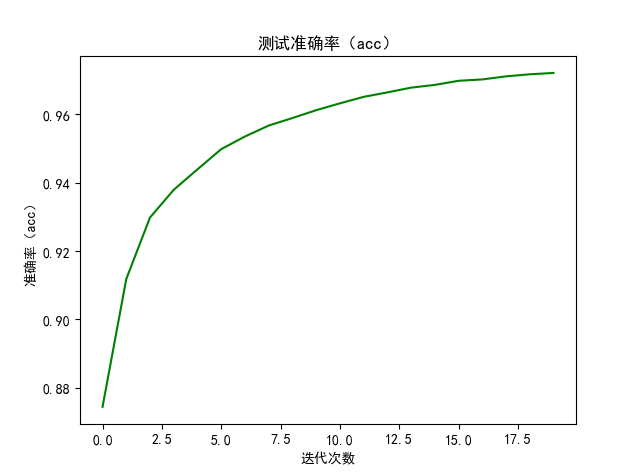
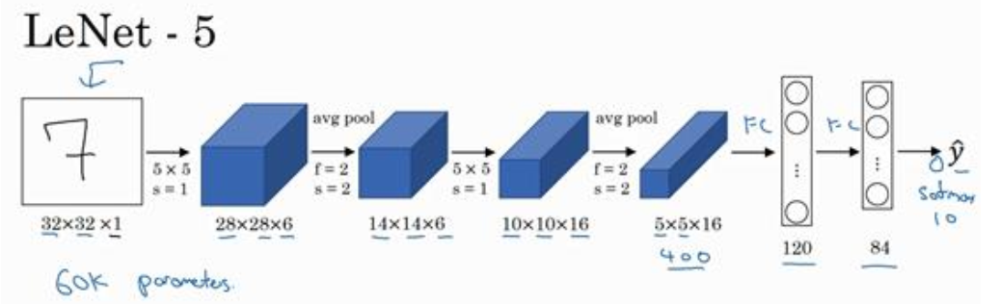

# 	numpy-realizes-CNN (LeNet5)

​	这是本人的第一个github程序。适用于想要了解CNN基本组成模块的原理及实现。无论您是初学者还是已经了解BP算法，只要您没有自己动手实现过，
那么就推荐您参考、查看。代码有详细的注释，程序的设计方面向pytorch靠拢，
所以你会发现网络的搭建，以及训练过程跟pytorch的使用习惯相似。  
具体学习流程如果你不习惯读README.md，那么可以看我的知乎：https://zhuanlan.zhihu.com/p/296592264

## 1、安装：
   * anaconda+pycharm（注python3.0以上）
   * 具体安装网上教程一抓一大把
   
   
## 2、实验结果

   
   
   
   

|        baseline       |      lr       |    epoch   |      准确率     |
| :-------------------: | :----------:  | :-----:|:------------: | 
| **没有做任何归一化处理** |    **1e-5**   |    **20**  |    **93.52%**   |
| **只对输入做归一化处理** |    **1e-3**   |    **20**  |    **96.53%**   |
| **加入BN层归一化处理**   |    **1e-3**   |   **20**   |   **97.21**    |

   
   * 实验中为了节省时间只训练20个epoch，然后观察结果，期间不改变学习率
   * 通过这三个实验我们得到结论：训练数据不做任何的归一化处理，网络极容易出现梯度爆炸的问题，因此只能采用小学习率，这
   导致网络的收敛速度极慢，第一个实验20个epoch后网络还没有完全收敛；只对输入做归一化收敛，可有效避免梯度爆炸的问题
   但是熟练速度依旧较慢；加入BN层，网络熟练速度明显加快，且精度还有提升（可见论文中提到的“加快收敛甚至可以提高精度”的说法是
   完全对滴！！！）
   * 接下来的工作，加速网络收敛的同时，进一步提高准确率
   
   
## 3、程序说明（代码中有详细注释）

###  3.1 卷积层

| con.py           |  使用了for循环，速度低下       |
| :--------------- | :----------------------:   | 
| **con_fast.py**  |     **利用mag2col函数，实现了卷积的快速运算**    |

 
   * 参考资料：  
   
      
      前向+反向传播过程推导：
      https://blog.csdn.net/qq_16137569/article/details/81449209
      https://blog.csdn.net/qq_16137569/article/details/81477906
      但是这个链接会给出W,b更新公式是错的。
      
   * 说明：为了简化复杂度，默认卷积核均为正方形；行/列方向的步长一样；关于img2col的实现感觉网上讲的都不够直观，可以看“鱼书”中的插图
    （非常直观）

### 3.2 池化层

|     pooling.py    |  **实现池化层**  |
| :---------------: | :------------: | 
|    *Maxpooling*   |    *最大值池化*  |
| *Averagepooling*  |    *平均池化*   |

   * 推导过程：https://blog.csdn.net/qq_16137569/article/details/81477906
    实现参考：https://zhuanlan.zhihu.com/p/70713747
   * 说明：为了简化问题，默认池化层的核均为正方形；核的尺寸与步长一样

### 3.3 全连接层：fc.py
   * 全连接层的实现比较简单，（NG的视频上已经非常清楚）。有两种略有不同的实现方式但是原理上是一样的。我会写个知乎解释：
   * 知乎链接----------------（敬请期待）

### 3.4 Dropout层：
   * 了解原理实现起来很简单。
   * 注：为了在不修改其他层的前提下，可以直接使用dropout模块。我们在dropout.py中只实现了随机失活功能(不更新权重)。
   所以使用时在fc层后加上dropout层即可。
   
### 3.5 batch normalization
   * BN层的原理理解起来很容易，但是实现起来还是有些困难的。首先：BN层有两种不同的实现方式（逐像素or逐通道），区别
   主要在于参数的数量。
   * BN层的反向传播的梯度计算相对较为复杂，可参考：https://zhuanlan.zhihu.com/p/68685625

### 3.6 激活层

| activate.py    |     实现各种激活函数    |
| :------------- | :-----------------:  | 
|     *ReLu*     |     *y=max(0, x)*    |
|    *sigmoid*   |     *y=1/(1+e^(-x))*    |
|     *tanh*     |     *y=(e^x-e^(-x)) / (e^x+e^(-x))*    |

   * 很简单，是所有模块中实现最简单的一个

### 3.7 损失函数: loss.py

|     loss.py    |     实现各种损失函数    |
| :------------- | :-----------------:  | 
|    *softmax*   |     *y=-ylna*    |
|      *ESM*     |     *敬请期待*    |
| *Cross-entropy*|     *敬请期待*    |

   * 推导过程：https://zhuanlan.zhihu.com/p/67759205
   * 实现参考：https://blog.csdn.net/QLBFA/article/details/107536486
   * 说明：目前只实现了一个softmax，后续会加入：均方差损失（ESM）、交叉熵损失（Cross-entropy）

## 4、实现LeNet5

   
   * 注：我的网络实现时，输入的图像尺寸为（1x28x28），所以第一个卷积采用了SAME填充方式，其他结构均与原论文一致。

|     net/LeNet5.py    |     实现LeNet网络结构+forward/backward    |
| :------------------: | :------------------------------------:  | 
|      **train.py**    |              **完成训练+测试**                |

  

## 附录：  
https://github.com/leeroee/NN-by-Numpy  （函数接口参考）  
https://github.com/wuziheng/CNN-Numpy  （实现参考）

>>> 地球人都爱猫，这是大自然定的---------沃兹基硕德
   

